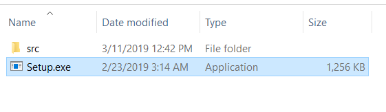
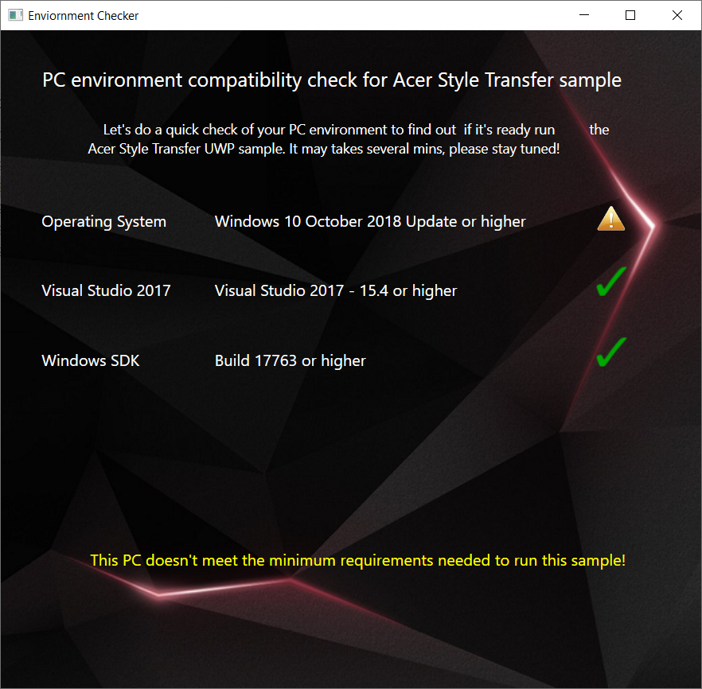
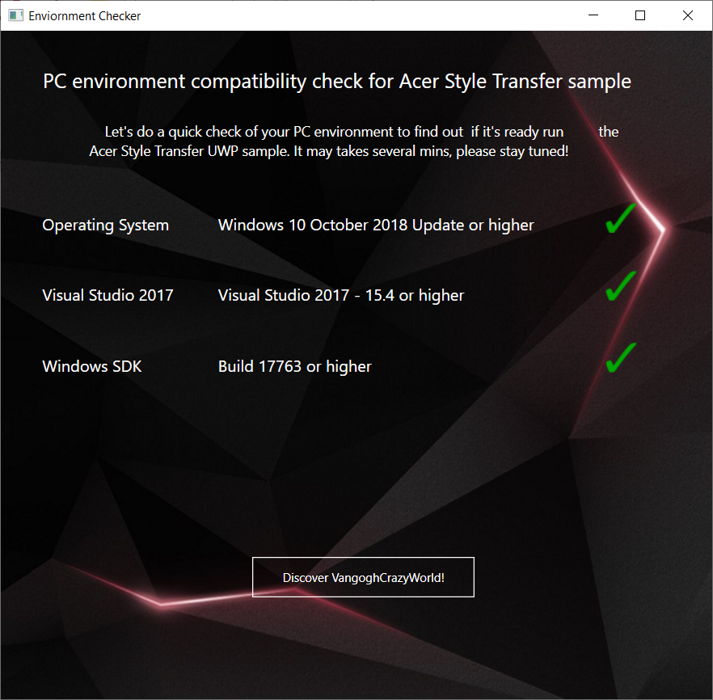
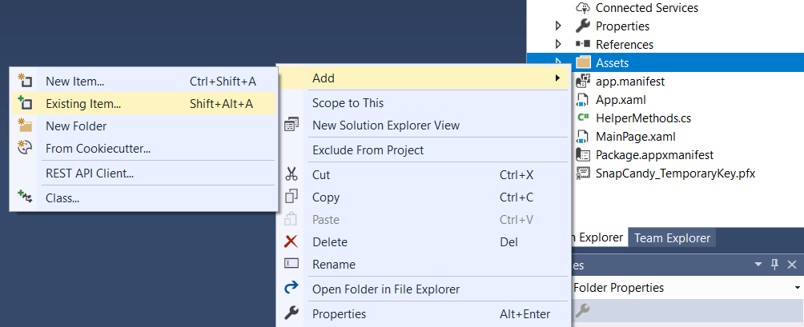

## Quick Start
Download <a href="https://github.com/acerwebai/VangoghCrazyWorld-UWP/releases/download/v0.3/VangoghCrazyWorld_UWP_20190311_2.zip">latest released build</a> to quick setup your environment for build UWP for Vangogh Crazy World.

Once you have downloaded the sample, you can find the "Setup.exe" in folder. The "Setup.exe" provided an easy-way that help you preparing your system to meet the minimum system requirements.

You may meet some problem, but no worry! Just press the "Exclamation mark" and we have provided instruction to let you know how to fix it!

 

## Neural style transfer
This UWP C# app uses the Neural style transfer model to re-style images or video streams. Offering you a variety of beautiful styles some of which are paintings by famous artists like Starry Night by Van Gogh. (Of course, you can train your own style model and import to this UWP sample from [here](https://github.com/AcerWilliamH/VangoghCrazyWorld)  

For how-tos, tutorials and additional information, see the [Windows ML documentation](https://docs.microsoft.com/windows/ai/).

## Getting Started
### 1.Prerequisites
The only thing you need to do is press the "Setup.exe" and find the button to launch the sample, the button will auto trigger VangoghCrazyWorld project via Visual studio

### 2.Run Samples
Once you have open the project, you can easy build the code with 
  1. Clean the project
  2. Build the project 
  3. Enjoy the effect!

### 3.How to import your own ONNX model? 
  1. Once you have trained own style ONNX model via [here](https://github.com/AcerWilliamH/VangoghCrazyWorld), you can drop your ONNX model into "Asset" folder.
  2. Under Solutions Explorer/ Assets Folder add model file to project by selecting Add Existing Item.
  3. Change properties of model just added: "Build Action" -> "Content"
  4. Add the onnx model name in "_kModelFileNames" function
  
  
  
  5. Build and run
  6. Click button to select image to enjoy the style!

## Requirements

- [Visual Studio 2017 - 15.4 or higher](https://developer.microsoft.com/en-us/windows/downloads)
- [Windows 10 - Build 17763 or higher](https://www.microsoft.com/en-us/software-download/windowsinsiderpreviewiso)
- [Windows SDK - Build 17763 or higher](https://www.microsoft.com/en-us/software-download/windowsinsiderpreviewSDK)

## Contributing

We're always looking for your help to fix bugs and improve the samples. Create a pull request, and we'll be happy to take a look.
